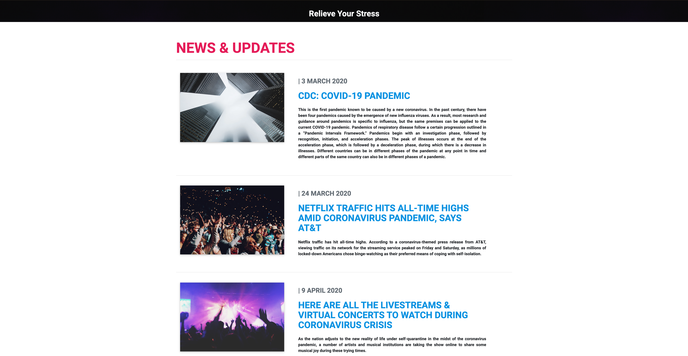

# QuaranStream

>  #Project-2 for UNC Bootcamp utilizing Node, MySQL, Express, Bootstrap and MVC design.

## Table of Contents

* [Description](#description)
* [Installation](#installation)
* [Usage](#usage)
* [Screenshots](#screenshots)
* [Built With](#built-with)
* [License](#license)
* [Contributing](#contributing)

## Description
Inspired by a time of immense boredom caused by the Corona Virus Stay-At-Home order, QuaranStream supplies users with new entertainment options tailored to their favorite media genres.

 * This full-stack application is deployed on Heroku : https://limitless-chamber-20765.herokuapp.com/

## Installation

 * Clone this repository from Github from the command line by typing:  
   `git clone https://github.com/keshavsavva/QuaranStream.git`
  * Navigate to the 'quaranstream' folder by typing:  
  `cd quaranstream` 
  * Install dependencies by typing:  
   `npm install`
  * Run this application by typing:   
  `npm start`
  * The application will open on localhost:3000

  ## Usage
  
  * Once you have this application running on your local machine or Heroku you will be directed to the landing page. From there press the button that says *'Get Started'*.  This will redirect you to the sign-in Page where you must enter a valid email address and password to proceed.  This will redirect you to the questionaire page where you can select an avatar image, an alias, and write a short bio.  You can also choose your genre preferences for video games, music, tv, and movies.  Press the *'Submit'* button to save these preferences and see your media suggestions.  If you ever want to update your preferences just click the button in the top-left corner of the screen and a sidebar will slide out.  Scroll down to the bottom and select the link that says *'Update User Preferences'*.  This will take you to a page where you can change any of your user information. 
  
  ## Screenshots
* Landing Page

* News Page

* Login Page

* Settings Page

* Recomended Content Page

   
  ## Built With  
  &nbsp;&nbsp;&nbsp; 
  
 &nbsp;&nbsp;&nbsp;
  &nbsp;&nbsp;&nbsp; 	 
 &nbsp;&nbsp;&nbsp;  	   	 
  	 &nbsp;&nbsp;&nbsp;  	
   

* **Node.js** -  JavaScript environment that executes JS code without needing a web browser
* **Express** - Web application framework that helped with routes and requests
* **MySQL** - Highly stuctured relational database for storing user data
* **Bootstrap** - UI framework for making interactive user components

## License 
MIT: 
---

## Contributing

* Contributing Team Members

**Keshav Avva**
     
- Email : [keshav.s.avva@gmail.com](keshav.s.avva@gmail.com)
- Github : [@keshavsavva](https://github.com/keshavsavva)

**Alex Coulter**
    
- Email : [alexcoulter.unc@gmail.com](alexcoulter.unc@gmail.com)
- Github : [@alexcoulter](https://github.com/alexcoulter)

**Diantai Johnson**
    
- Email : [johnson.diantai@gmail.com](johnson.diantai@gmail.com)
- Github : [@Alteredskull](https://github.com/Alteredskull)

**Tyler Buck**
     
- Github : [@thetylerb](https://github.com/thetylerb) 

Give a :star: or follow me if this project helped you.
### Any suggestions or questions are welcome!