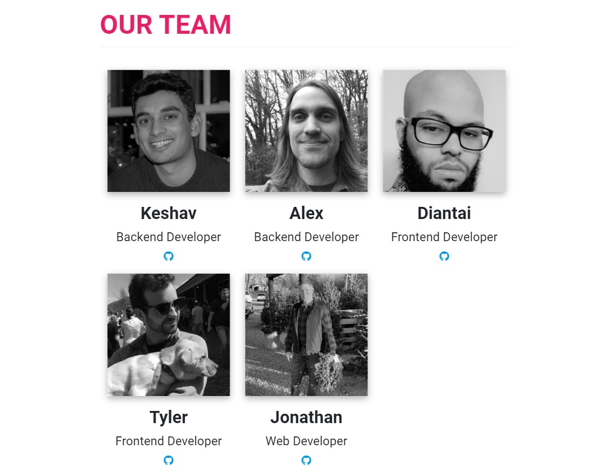

# QuaranStream

 &nbsp;&nbsp;&nbsp; 	 
  &nbsp;&nbsp;&nbsp; 	 
  
 &nbsp;&nbsp;&nbsp; 	 
  
 &nbsp;&nbsp;&nbsp; 	 
  

## Table of Contents

* [Description](#description)
* [Installation](#installation)
* [Usage](#usage)
* [Screenshots](#screenshots)
* [Built With](#built-with)
* [Contributing](#contributing)

## Description

This application supplies users with activities to occupy their time during the Coronavirus quarantine.  It will give you recommendations for music, tv shows, movies, and video games that you may like and provides information and links so that you may learn about these recommendations.  You can also connect with other users and see what types of media they are interested in.

 * This full-stack application is deployed on Heroku : https://limitless-chamber-20765.herokuapp.com/landing.html#home

## Installation

 * Clone this repository from Github from the command line by typing:  
   `git clone https://github.com/alexcoulter/quaranstream.git`
  * Navigate to the 'quaranstream' folder by typing:  
  `cd quaranstream` 
  * Install dependencies by typing:  
   `npm install`
  * Run this application by typing:   
  `node server` 
  * Open this application in your browser by typing the url:
  `http://localhost:8080/`
  
  ## Usage
  
  * Once you have this application running on your local machine or Heroku you will be directed to the landing page. From there press the button that says *'Get Started'*.  This will redirect you to the sign-in Page where you must enter a valid email address and password to proceed.  This will redirect you to the questionaire page where you can select an avatar image, an alias, and write a short bio.  You can also choose your genre preferences for video games, music, tv, and movies.  Press the *'Submit'* button to save these preferences and see your media suggestions.  If you ever want to update your preferences just click the button in the top-left corner of the screen and a sidebar will slide out.  Scroll down to the bottom and select the link that says *'Update User Preferences'*.  This will take you to a page where you can change any of your usetr information. 
  
  ## Screenshots
* Landing Page

* Questionaire

* Results

* Sidebar

   
   ## Built With  

* **Node.js** -  JavaScript environment that executes JS code without needing a web browser
* **Express** - Web application framework that helped with routes and requests
* **Mysql** - Open Source Database Management System
* **Sequelize** - Javascript library that helped us to manage our mysql database
* **ORM** - *'Object Relational Mapping'* was used so that we didn't need to make sql queries
* **MVC Design** - Model View Control architecture seperates the files in the app into these 3 areas for better organization of code
* **Jquery** - Javascript library that made ajax calls and dynamically produced html much easier 
* **Materialize** - a front-end framework we used to help style our application and give it a modern feel
* **Bootstrap** - a front-end framework we used for styling the login-pages and creating columns that are mobile-responsive

## Contributing

* Contributing Team Members

   
